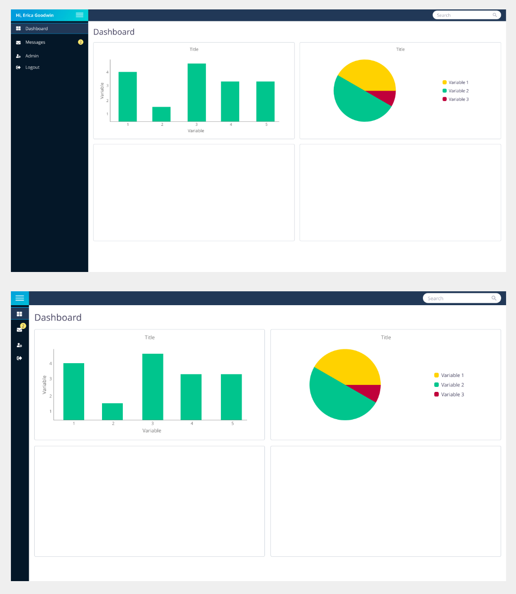

# dashboard_app_potato

## Run
`npm install`

`npm run dev`

## Mockup

## Plan
A Vue.js 3 project has been set up as a playground to practise Vue.js, user interaction, structure, and styling. The structure takes inspiration from the above mockups, incorporating a collapsable sidebar, header, and main section to be filled with cards of information. The primary focus is on the cards, however, if there is a desire to progress further there is room to  do this by adding tests, introducing other pages (suggestions exist in the sidebar), implementing the search functionality in the header, implementing a login,  or adding more ideas to the design and app.

The cards are laid out using css grid (2 x 2), giving each person a quarter of the available space to play with. The cards could include data from APIs, for example,  a film search,  fitness data, recipes, artwork; it could include user interaction to allow you to practise JS and DOM manipulation; it could even be a collection of your favourite dog photos; all ideas are welcome.

To add to the app, go into `src > components > widgets` to find your card component. The card components are numbered and assigned as following:

1. `One.vue` -> Alexa
1. `Two.vue` -> Purvi
1. `Three.vue` -> Erica

Make a branch and start creating!

**API keys**: if you need to use an API key, store the key in a `.env` file and add it to the gitignore file to ensure it is not pushed to GitHub.

**Submitting work**: make a pull request and add a reviewer. When the reviewer is happy they will merge the changes into the `main` branch.

### Useful Links
* Vue 3 docs: https://v3.vuejs.org/
* Set up Vue project with Vite: https://learnvue.co/2020/12/setting-up-your-first-vue3-project-vue-3-0-release/
